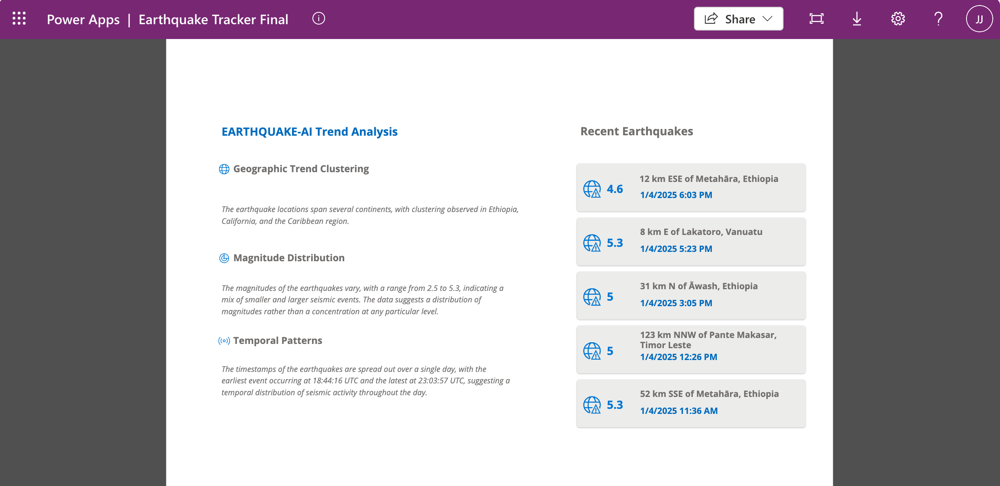
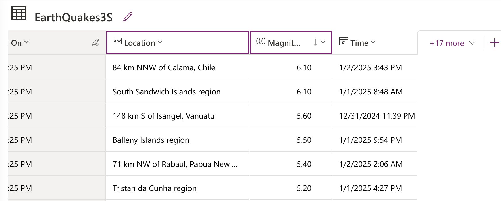
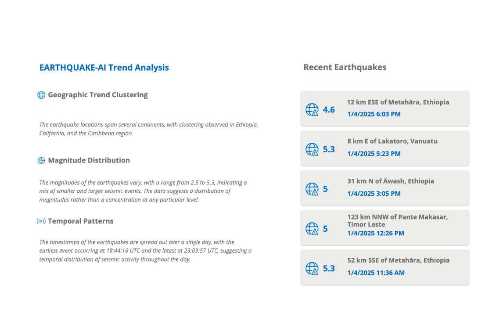
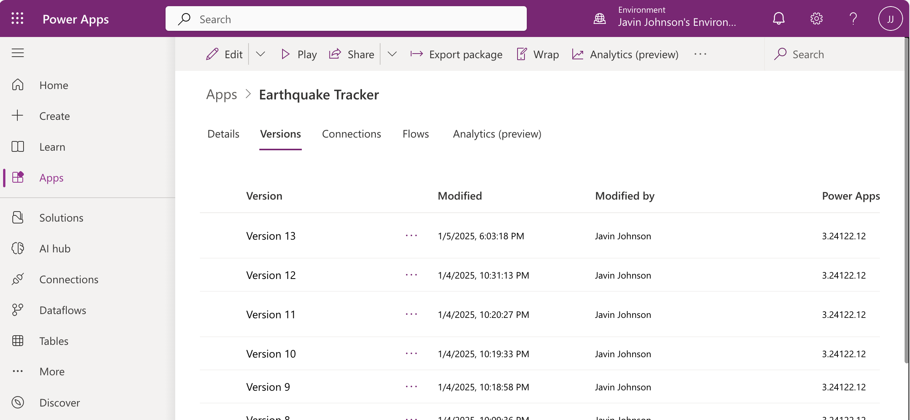
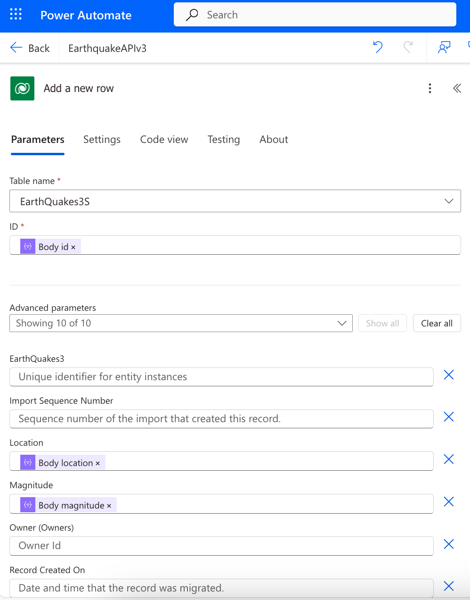
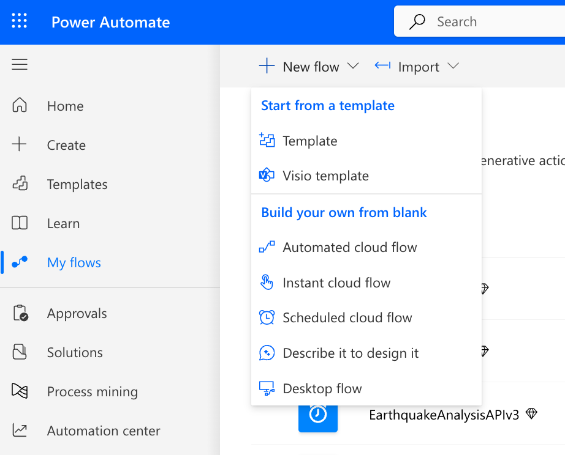
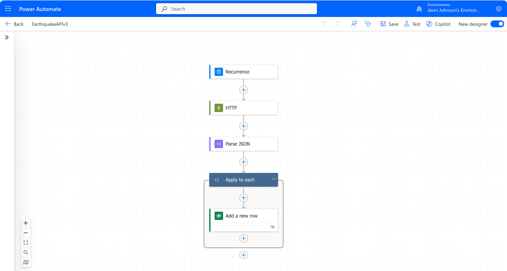

# Earthquake Tracker: Model Driven LLM Qualitative Analysis Dashboard

_Analyzing earthquake data in realtime through LLM qualitative analysis and REST APIs using Microsoft's Power Apps platform._

## OVERVIEW

In analyzing and understanding the dynamic forces of earthquakes we face a challenge: while we have unprecedented access to real-time big data about these natural phenomena, the sheer volume and complexity of this information can be overwhelming. Through Large Language Models (LLMs), we can analyze big data qualitatively using the emergent nature of "Theory of Mind" capabilities of LLMs.

The **Earthquake Tracker** project began as an exploration of model-driven Microsoft Power Apps focusing on integrating various systems including **LLMs, Microsoft Dataverse, Power Automate, and a custom REST API server (EARTHQUAKE-AI)** to analyze earthquake data in real time.

---

The major components include:

**I. Dataverse**

**II. Power Apps**

**III. Power Automate**

**IV. EARTHQUAKE-AI**

 

## DATAVERSE

Microsoft Dataverse tables serve as the data layer for both earthquake data and qualitative LLM analysis. The data model lives in the Microsoft Cloud, enabling interaction with Microsoft Power Automate for real-time database operations.

While the earthquake API also provided extensive data including latitude and longitude, for simplicity the focus was on three features: location, magnitude, and time.

 

## POWER APPS

The dashboard GUI was implemented in Microsoft Power Apps as a model-driven application, focusing on data visualization and real time updates.

 

**Features**

- integraton with Microsoft Dataverse tables for data management

- data updates through Power Automate integration
   
- displaying both earthquake data and qualitative LLM analysis
  
- card elements showing recent earthquake data points and their magnitude, location, and time

The Earthquake Tracker app can be published from various versions. An email invitation is required since the app is accessed by Microsoft group permissions.

 

 

## POWER AUTOMATE

The Microsoft Power Automate platform is the engine behind automating workflows across the Microsoft ecosystem. The project leveraged Power Automate to gather real time earthquake data from a custom REST API server.

 

 

With Power Automate we can make a scheduled flow to perform a GET API request, which repeats per any time interval for real time updates. To make the flow, we start with a Recurrence node, which represents the scheduled flow entry, followed by an HTTP and Parse JSON node to convert the web data, and then we iterate with a new row node to write the data to the Dataverse table.

 

 

 

## EARTHQUAKE-AI

EARTHQUAKE-AI is a custom asynchronous server that runs continually in the cloud. The app obtaines API data from various sources, processes and formats the data for easier downstreaming processing through Microsoft Power Automate that can then leverage the Microsoft ecosystem.

The server tech stack includes Python, FastAPI, and Railway with nixpacks, an abstraction layer above Docker for seamlessly deploying various development environments, essentially taking care of dependency management. The system could be easily expanded for scientific analysis using various libraries and frameworks such as Anaconda and OpenCV, while nixpacks would take care of the environment deployment details.

The key to integrating the LLM with the data is to construct a prompt request requiring that any data output should come back in the form of JSON, which is what we can use for downstream processing.

 

## SUMMARY

The Earthquake Tracker project aimed to build a model-driven app through Microsoft Power Apps and the Microsoft ecoystem while utilizing the emergent human-like reasoning (Theory of Mind) capabilities of LLMs. Using earthquake data, the LLM demonstrated the ability to make qualitative inferences, such as identifying broader patterns in geographic trend clustering and capturing larger regions, tasks that would not be straightforward to implement using more conventional techniques.

The project integrated multiple systems: Microsoft's Dataverse for the data management foundation, Power Apps for the dashboard interface, Power Automate for real-time data flows, and EARTHQUAKE-AI, a specialized microservice API gateway and LLM analysis engine. EARTHQUAKE-AI's use of nixpacks technology enables rapid setup and cloud deployment of scientific development environments which could be further expanded to include Anaconda or OpenCV for instance.

EARTHQUAKE-AI can readily accomodate the aggregation of various further atmospheric and weather phenomena, transmitting data downstream to utilize the Microsoft ecosystem through Power Apps and Power Automate.
